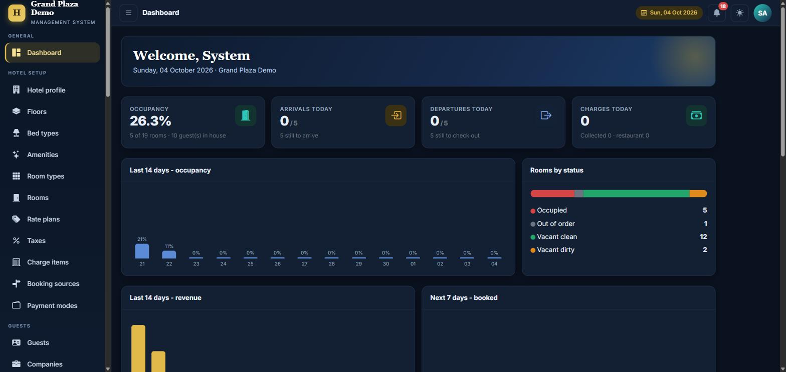
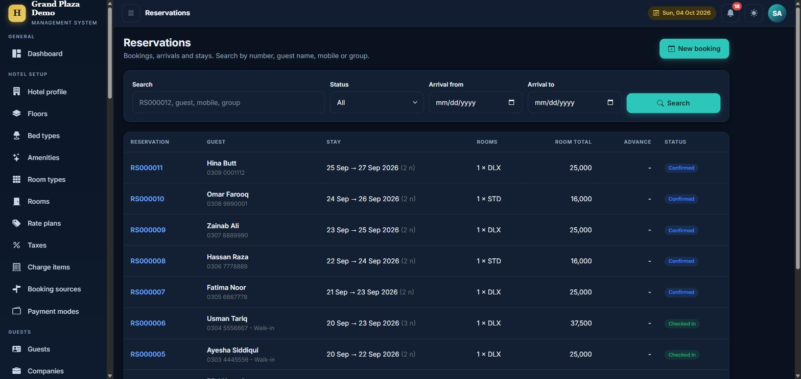
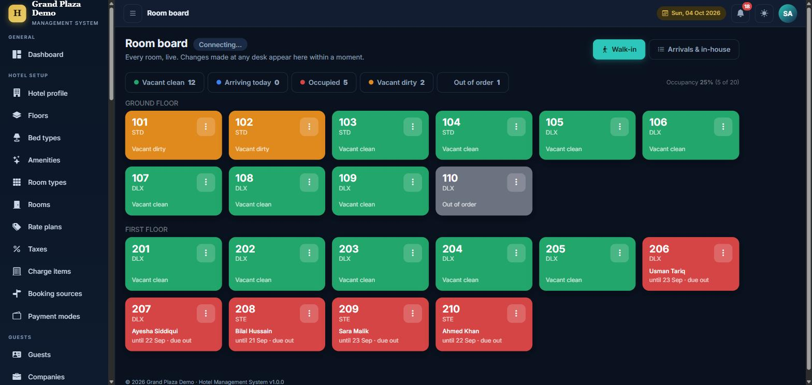

# 🏨 Hotel Management System

A complete, production-grade hotel management web application covering the full guest lifecycle — from reservation to checkout and reporting.

> **Showcase repository.** This page documents the project's features and architecture. The source code is proprietary and delivered to the client, so it is not published here.

## ✨ Features

- **Reservations & front desk** — bookings, check-in / check-out, room status board
- **Billing & invoicing** — folio, extra charges, taxes, payments and receipts
- **Housekeeping** — room cleaning status and task tracking
- **Role & permission model** — fine-grained access per user and screen
- **Real-time updates** — live room and booking changes via SignalR
- **Reports & dashboards** — occupancy, revenue and daily summaries
- **Backup / restore** — built-in database backup and recovery
- **Installable PWA** — works smoothly on desktop and mobile

## 🧱 Tech Stack

| Layer | Technology |
|-------|-----------|
| Backend | C#, ASP.NET Core MVC (.NET 9) |
| Data access | Dapper with SQL Server stored procedures |
| Database | Microsoft SQL Server |
| Real-time | SignalR |
| Frontend | JavaScript, jQuery, Bootstrap, PWA |
| Security | Cookie authentication, role / permission based authorization |

## 🤝 Need something similar?

I build custom hotel, pharmacy, ERP and ordering systems, and modernize legacy WinForms / VB.NET apps to ASP.NET Core. See my [profile](https://github.com/SalmanDosani-Dev) for more.

## 📸 Screenshots

| | |
|---|---|
|  |  |
|  | |
